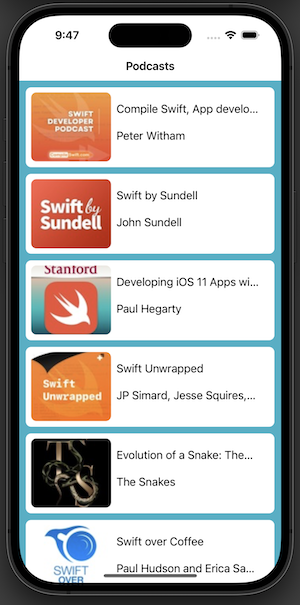
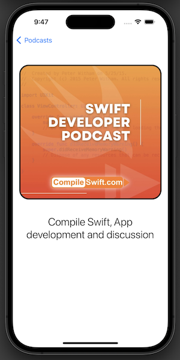

# ProgrammaticPodcasts
App that incorporates storyboard, xibs, and programmatic code.

## Features
- Use of a iTunes api to get podcast info; JSON decoding
- Custom podcast cell using a nib file 
- Programmatic setup and code 
- Stand alone storyboard file for the detail controller

### Images
 
